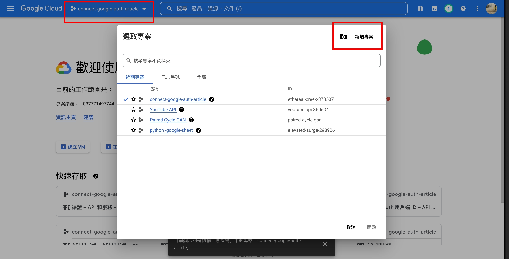
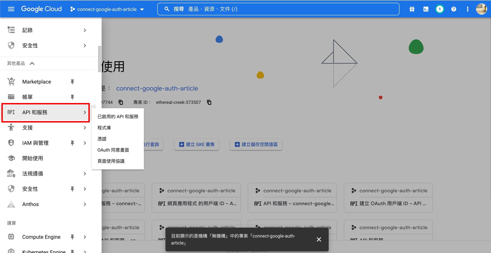
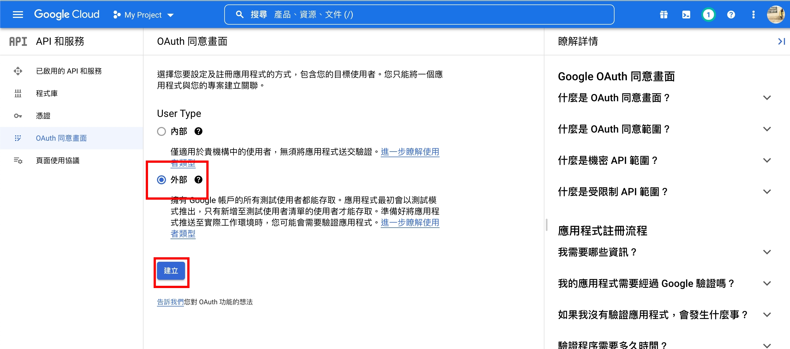
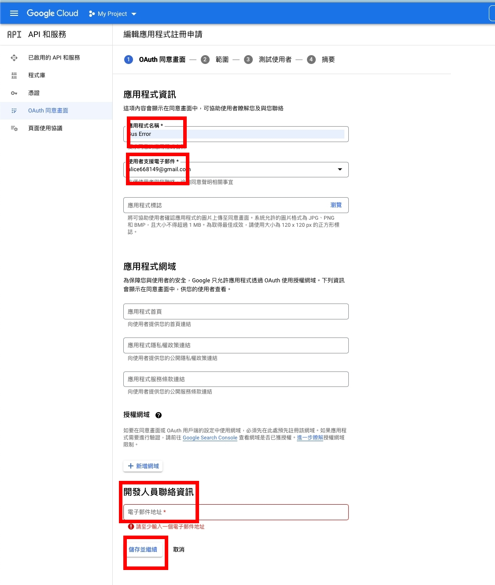
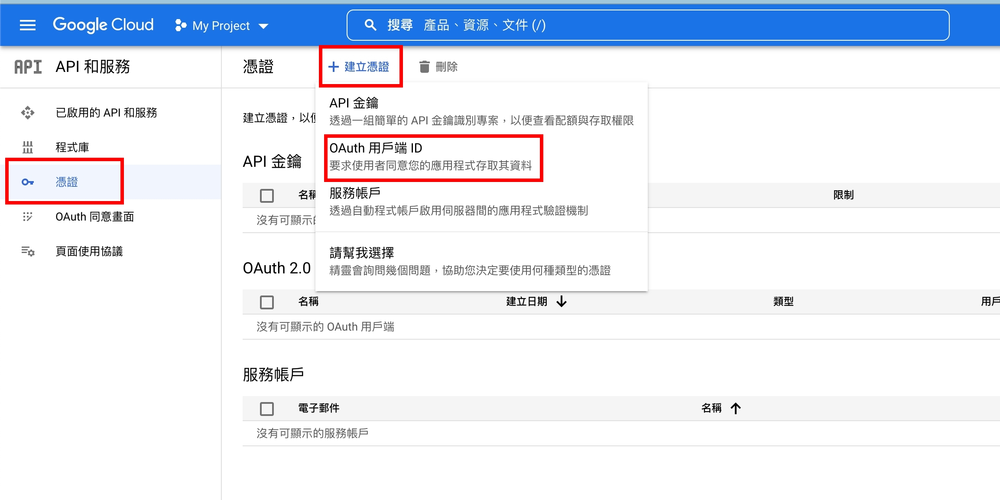
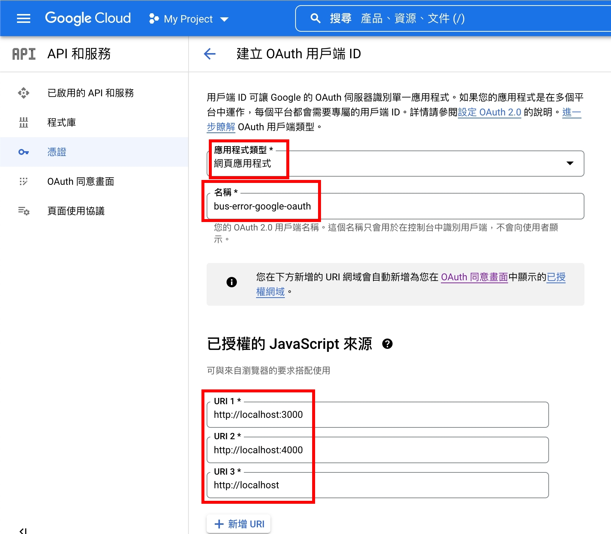
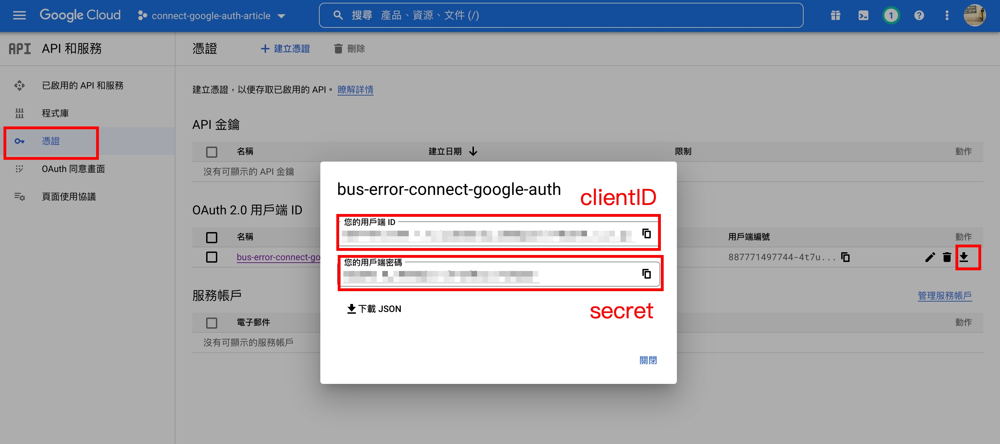

# **[111-1] Web Programming Final**

## (**Group 22) Bus Error – 台灣的技術論壇 🚌**

- 我們製作了一個提供軟體開發者們交流的論壇。在這個網站上，使用者可以
    
    ****自由提問****—碰到困難了嗎？不妨向社群伙伴提問，讓大家一起跟你找出答案。
    
    ****盡情討論****—在此尋找和你遇上相同疑難的人，一起討論問題、分享見解，找出最佳解決方案。
    
- **Demo 影片：** [https://youtu.be/k_5798L-jHE](https://youtu.be/k_5798L-jHE)
- **Deployed 連結：**[Bus Error – 台灣的技術論壇討論區 🚌](https://bus-error-production.up.railway.app/)
- **Github：**[itsalicelee/Bus-Error (github.com)](https://github.com/itsalicelee/Bus-Error)
- **組員：**
    - B07303024 李品樺
    - B10902099 韓智杰
    - B10101053 邱冠銘

### 🚌  功能介紹

- **使用者：**
    - Google OAuth2.0登入
    - 更新個人名稱
    - 使用者資訊統計（加入社群天數/貼文數/留言數/留言被採納數）
- **文章：**
    - 列出所有文章，用主題篩選文章
    - 顯示每篇文章的總評分/留言數/閱覽次數
    - 將文章按照最新/熱門/尚待解決排序
    - 支援Markdown語法新增貼文，並在發布前先預覽
    - 刪除、推噓文章
- **留言：**
    - 推噓留言
    - 依照最高分/最新排序
    - 支援Markdown語法新增留言，並在發布前先預覽
    - 文章作者可採納意見
- **介面：**
    - Dark Mode

### 🚌  使用與參考之框架/模組/原始碼/第三方套件

- **前端：**
    - React.js, antd, Axios, FortAwesome, PropTypes
    - 日期格式化及運算：Day.js
    - 文章顯示：React-Markdown (另配合 KaTeX, remark-gfm, rehype-katex, remark-math 等使用)
    - 程式碼規則檢查：ESLint
- **後端：**
    - Node.js, Express, cors
    - 身份驗證：Google Auth Library, JsonWebToken
- **資料庫：** 
    - MongoDB

### 🚌  專題製作心得

- 李品樺：
    
    > 在學期中的時候就有個想法想要做論壇類的專題，非常感謝我在臉書社團中所找的兩位組員們不但採納了我的想法，也從頭到尾都非常罩的解決了許多問題，真的深深的感謝🥺   多虧兩位組員強大的前後端功力以及默契，讓我們的期末專題可以順利完成。另外也很感謝熱心的同學半夜兩點多回答我們利用deploy網站遇到的問題，讓我們的網站可以順利deploy。我覺得期末專題是一個真正考驗大家把所學整合在一起的機會，透過專題從零開始build出一個全端的網站真的很有成就感，也順便複習了整個學期所學的東西。希望之後也能持續維護這個網站，並且持續推出新功能！
    > 
- 韓智杰：
    
    > 我覺得時間跟合作是這次專案裡最具挑戰性的部份。因為每位組員所負責的部份都有所不同，所以要能清楚地跟別人解釋自己的想法和需求，其中就包含了清楚的 commit message 跟規範化的 code style。不得不說，這對於以前 commit message 只打一個點、都寫 ninja code 的我而言是一個大挑戰，但從中也能學到不少的經驗。
    > 
    > 
    > 時間的部份，因為這學期過於高估自己的能力，選了太多的課，導致到了 12 月底才開始碰 code。但好在隊友夠 carry，一切都還趕得上。能在時間緊湊的學期末把專案做到這個程度，心裡真的只剩下感動了。
    > 
- 邱冠銘：
    
    > 這次專案中，我覺得最困難的部分就是在於程式協作。為了確保 code 的品質還有一致性，在專案中必須非常注重 commit message 還有乾淨的 code style。因此我們決定引用 ESlint 並用 Airbnb 的規範進行程式檢查。一開始在寫的時候真的是極其痛苦，只要格式有錯就會直接 compile error。儘管一開始的適應期蠻長的，但是也從中了解到乾淨的 code style 確實對程式協作非常有幫助。
    這次專案對我來說是一個非常有趣的挑戰！從一開始討論到真正實作，雖然遇到了一大堆沒遇到過的可怕問題，但是最後都有透過團隊合作、討論還有不斷的熬夜來解決。著實是很感謝組員們的大力凱瑞，最後能順利完成真的非常有成就感。也希望未來能在這個領域持續前進**🚀🚀**。
    > 
    

### 🚌  **如何在 localhost 安裝與測試**

1. 建立Google OAuth 2.0的**clientID**和**secret** *(可略過，並直接使用我們提供的資訊)*
    - 在[Google cloud console](https://console.cloud.google.com/)建立一個新的專案
        
        
        
    - 在側邊的欄位選擇**API和服務**
        
        
        
    - 在**OAuth同意畫面**選擇**外部**並建立
        
        
        
    - 填寫應用程式名稱以及信箱
        
        
        
    - 在**憑證**頁面點選**建立憑證>OAuth用戶端ID**
        
        
        
    - 應用程式類型選擇**網頁應用程式**，填寫任意名稱，已授權的JavaScript來源請填寫 **http://localhost:3000, http://localhost:4000, http://localhost**
        
        
        
    - 點選下載按鍵取得clientID以及secret
        
        
        

2. 在此專案的根目錄之下：
- 安裝所需套件:  `yarn install:all`
- 新增後端環境變數檔案: `cp ./backend/.env.defaults ./backend/.env`
- 將步驟1取得的clientID以及secret填入`./backend/.env` ，並填入MONGO_URL
    
    > 若建立clientID與secret有問題，可使用以下的資訊
    > 
    > 
    > ```makefile
    > clientID: 887771497744-skrt87qhj0cfmhtlk672nna8ticrpkes.apps.googleusercontent.com
    > secret: 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
    > ```
    > 
    
    ```bash
    # in ./backend/.env
    MONGO_URL=[your mongo db url]
    GOOGLE_CLIENT_ID=[clientID]
    JWT_SECRET=[secret]
    MODE=[mode]
    ```
    
- 初次使用前，需要初始化資料庫。具體步驟如下（ 類似 Hack 2 的方式 ）：
    1. 把上方程式片段的 `MODE` 設為 `MODE=Reset`，並在根目錄執行 `yarn backend`。執行細節將透過標準輸出印在 console 中。
    2. 初始化完成後，請把上述的 `MODE` 設回 `MODE=` (空白)，避免以後每次執行時資料庫都被重置。
- 更改前端`./frontend/src/container/PageAuthButton.js` 第43行，填入clientID*(若使用我們提供的資訊可略過這步驟)*

```jsx
// Modify ./frontend/src/container/PageAuthButton.js Line 43 client_id
if (window.google) {
     window.google.accounts.id.initialize({
     client_id: '887771497744-skrt87qhj0cfmhtlk672nna8ticrpkes.apps.googleusercontent.com', // Modify to your clientID
     callback: handleGoogle,
});
```

- 開啟後端: `yarn backend`
- 開啟前端: `yarn frontend`
- 在`http://localhost:3000`瀏覽網頁
